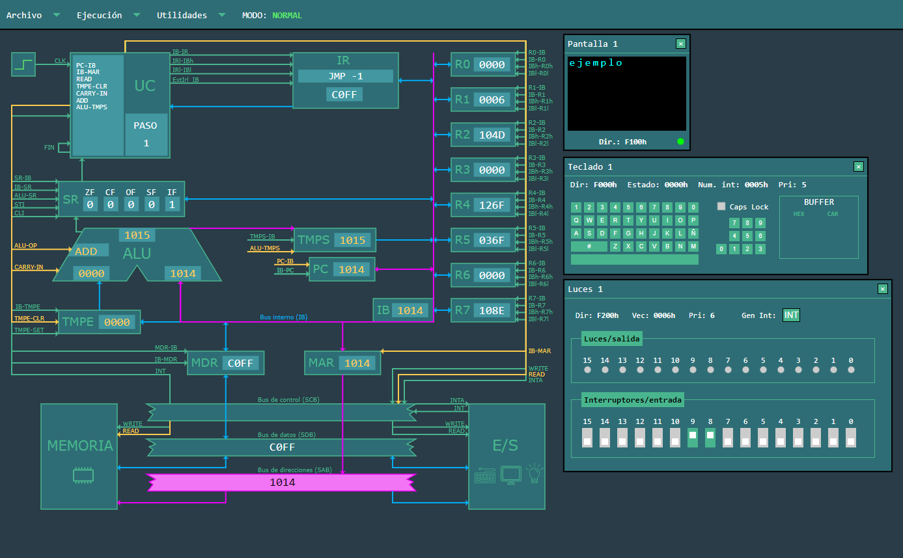

# SimCT

## Introducción

SimCT es un simulador web del Computador Teórico (CT) usado en la Uniersidad de
Oviedo (UniOvi). El computador fue creado por profesores del [Área de
Arquitectura de Computadores (ATC)](https://www.atc.uniovi.es/) de la
universidad. La versión inicial del simulador web ha sido desarrollada como 
Trabajo Fin de Máster por Jesús Andrés Lorenzana y está disponible en
[este repositorio](https://github.com/jesusandres/simct).

El simulador ofrece la posibilidad de configurar la memoria y los dispositivos
periféricos del CT, así como cargar y ejecutar programas. Además, permite
visualizar el funcionamiento interno del computador mientras se ejecutan las
instrucciones, ya sea de forma continua o instrucción por instrucción. También
se brinda la opción de realizar una ejecución paso a paso de cada ciclo de una
instrucción.

El simulador tiene también un modo manual en el que se puede seleccionar un
conjunto de señales que se desea ejecutar.

La siguiente imagen muestra un ejemplo de funcionamiento del simulador:



Para saber más sobre el Computador Teórico, se puede consultar el libro
[Computadores y Redes](https://www.atc.uniovi.es/libros/computadores_redes/).

## Ejecución

El simulador está desarrollado íntegramente en JavaScript como una aplicación
cliente, sin necesidad de un servidor. Se puede acceder a una versión ejecutable alojada en
GitHub en [esta dirección](https://asi-uniovi.github.io/simct).

Además, se puede descargar [este archivo](https://asi-uniovi.github.io/simct/simct.zip) y
ejecutarlo localmente.

## Desarrollo

El simulador está publicado como software libre con licencia MIT. Para
desarrollar, se puede clonar este repositorio y utilizar cualquier editor.

El código incluye tests para validar su funcionamiento. Para ejecutarlos,
instalar [node.js](https://nodejs.org/) y ejecutar en el directorio raíz de
este repositorio estas órdenes:

```
npm install
npm test
```

Estas extensiones facilitan el desarrollo en Visual Studio Code:

- [StandardJS](https://marketplace.visualstudio.com/items?itemName=standard.vscode-standard)
  para aplicar el estilo Standard JS al formatear y validar el código
  JavaScript.
- [Jest](https://marketplace.visualstudio.com/items?itemName=Orta.vscode-jest)
  para ejecutar los tests directamente desde el editor.
- [Jest
  Runner](https://marketplace.visualstudio.com/items?itemName=firsttris.vscode-jest-runner)
  para ejecutar tests individuales desde un menú contextual en la ventana de
  edición.
- [Live Server (5
  server)](https://marketplace.visualstudio.com/items?itemName=yandeu.five-server)
  para ejecutar el simulador en un servidor web local que se actualiza al editar
  el código.

Si se desean compartir los cambios que se hagan al código, se recomienda clonar
este repositorio y hacer un pull request.

## Versioning

The project version is defined in the file `app/config/version.js`.
To update the version, simply modify the `version` constant in this file.

After updating the version number and committing the change, remember to create a git tag for the new version:

```bash
git tag <new_version_number>
git push origin <new_version_number>
```

Replace `<new_version_number>` with the actual version number (e.g., `v1.0.2`).

## Changelog

### v1.0.2
- Prevent the user from moving windows outside the screen.

### v1.0.1
- First release with versioning system.

